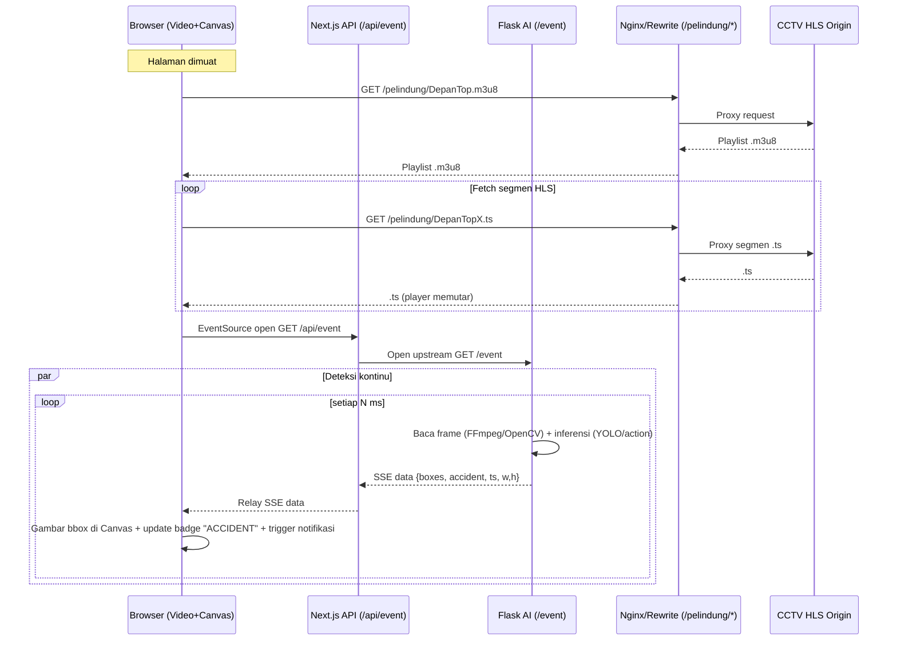

```mermaid
sequenceDiagram
  participant U as Browser (Video+Canvas)
  participant NX as Next.js API (/api/event)
  participant FL as Flask AI (/event)
  participant NG as Nginx/Rewrite (/pelindung/*)
  participant OR as CCTV HLS Origin

  Note over U: Halaman dimuat

  %% Video path (HLS)
  U->>NG: GET /pelindung/DepanTop.m3u8
  NG->>OR: Proxy request
  OR-->>NG: Playlist .m3u8
  NG-->>U: Playlist .m3u8

  loop Fetch segmen HLS
    U->>NG: GET /pelindung/DepanTopX.ts
    NG->>OR: Proxy segmen .ts
    OR-->>NG: .ts
    NG-->>U: .ts (player memutar)
  end

  %% Event path (SSE)
  U->>NX: EventSource open GET /api/event
  NX->>FL: Open upstream GET /event

  par Deteksi kontinu
    loop setiap N ms
      FL->>FL: Baca frame (FFmpeg/OpenCV) + inferensi (YOLO/action)
      FL-->>NX: SSE data {boxes, accident, ts, w,h}
      NX-->>U: Relay SSE data
      U->>U: Gambar bbox di Canvas + update badge "ACCIDENT" + trigger notifikasi
    end
  end

```
