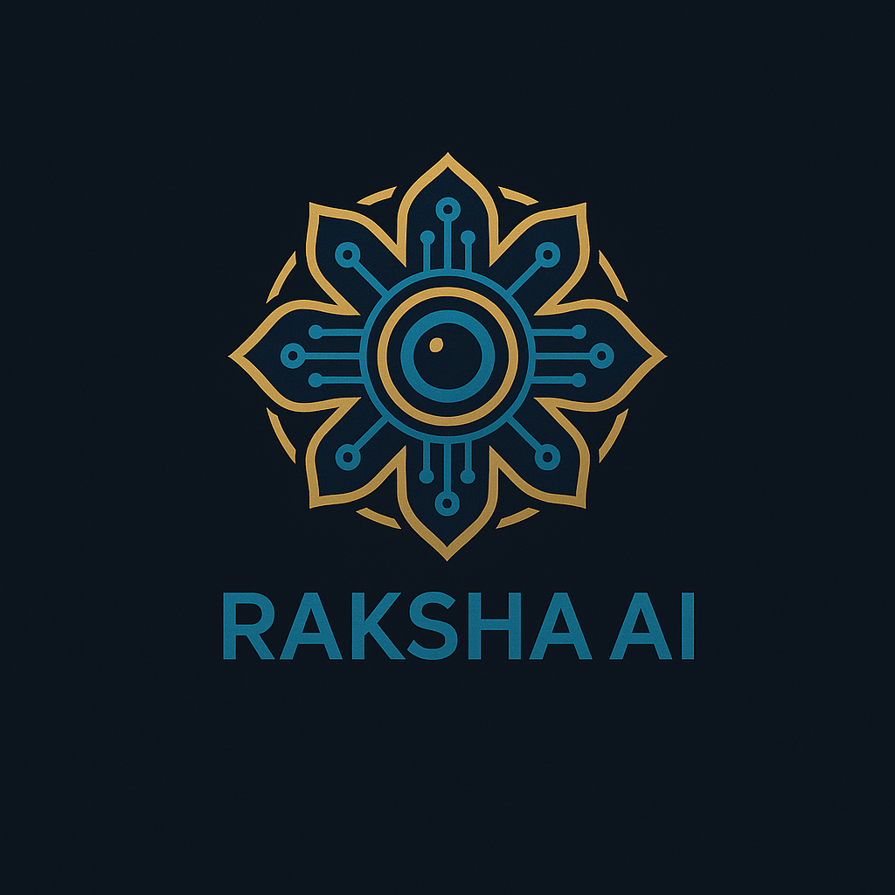

<div align="center">
    <div>
        
    </div>
    <div>
            <h3><b>Raksha AI</b></h3>
            <p><i>AI-Powered Crime Detection for a Safer Bandung</i></p>
    </div>      
</div>
<br>
<h1 align="center">Raksha AI - Compfest AI Innovation Challenge</h1>
<div align="center">


</div>
<br>

<b>Raksha AI</b> is an advanced surveillance system that leverages Artificial Intelligence to detect criminal activities in real-time from CCTV feeds across Bandung. Named after the Sanskrit word meaning "to protect", Raksha AI embodies our mission to safeguard the city of Bandung from suspicious activities using cutting-edge AI technology. By identifying suspicious behaviors and potential threats, Raksha AI aims to enhance public safety, accelerate emergency response, and create a more secure urban environment for all citizens.

<br>

## Tech Stack

<div align="center">
	
	
	
	
	
	
</div>

---

## Features

- **Real-time Anomaly Detection**: Automatically identifies unusual activities from live CCTV streams.
- **Criminal Activity Recognition**: Trained to recognize specific patterns of crime such as theft, vandalism, and assault.
- **Automated Alert System**: Instantly notifies law enforcement and relevant authorities upon detecting a threat.
- **Interactive Dashboard**: Provides a centralized view of all alerts, incident locations, and live feeds.
- **Crime Hotspot Mapping**: Visualizes crime data on a map to identify high-risk areas and inform patrol strategies.

---

## Live Demo

[https://raksha-ai.vercel.app/](https://raksha-ai.vercel.app/)

---

## Getting Started Locally

### Prerequisites

- **Node.js** (v18+)
- **Bun**
- **MongoDB**
- **Python**
- **Git**

### Clone the Project

```bash
git clone https://github.com/ZulfiFazhar/raksha-ai.git
cd raksha-ai

# Start the Frontend
cd Main-App
bun install
bun dev

# Start the AI Service
cd ../AI-Service
pip install -r requirements.txt
flask run
```

---

## .env Configuration

### Main-App (.env.local)

```
# Example .env for Frontend
NEXT_PUBLIC_API_URL=http://localhost:5000
```

### AI-Service (.env)

```
# Example .env for AI Service
MONGO_URI=
JWT_SECRET=
FLASK_ENV=development
```

---

## &nbsp;Website Preview

<table style="width:100%; text-align:center">
    <col width="100%">
    <tr>
        <td width="1%" align="center"></td>
    </tr>
    <tr>
        <td width="1%" align="center">Home Page</td>
    </tr>
    <tr>
        <td width="1%" align="center"></td>
    </tr>
    <tr>
        <td width="1%" align="center">Incident Dashboard</td>
    </tr>
</table>

---

## Architecture

<p align="center">
  
</p>

This diagram illustrates the system architecture of the Raksha AI application.

---

## Owner

This Repository is created by **CrackGPT**

<ul>
<li>Zulfi Fadilah Azhar - Full Stack Developer</li>
<li>Ratuayu Nurfajar - AI/ML Engineer</li>
<li>Muhamad Iqbal Reza - AI/ML Engineer</li>
</ul>
As a submission for the Compfest AI Innovation Challenge.

---

`Made with ❤️ by CrackGPT`
